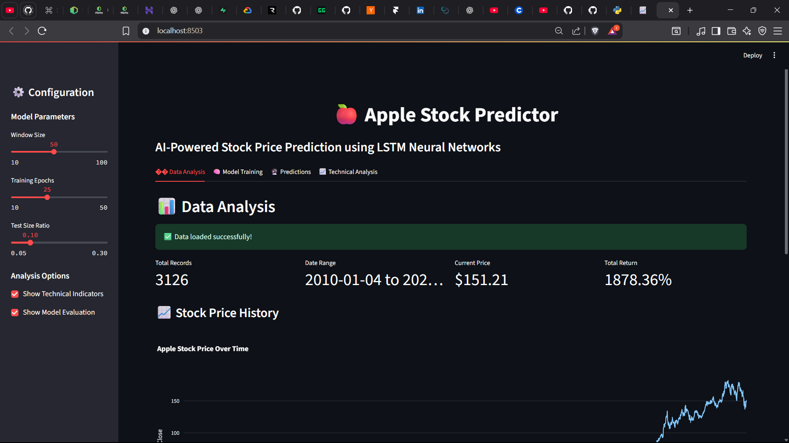
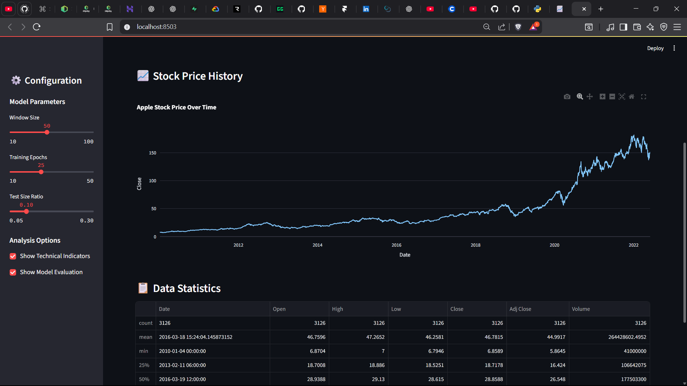
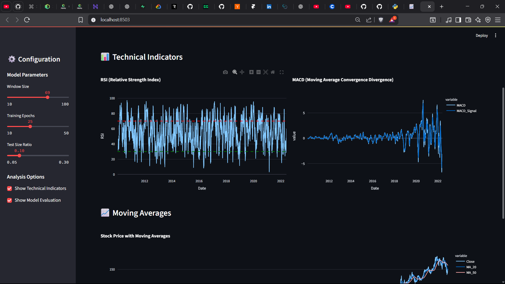
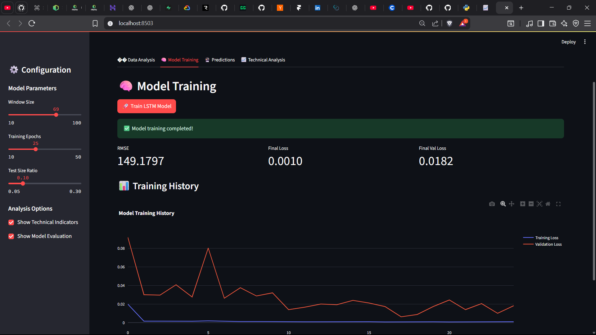
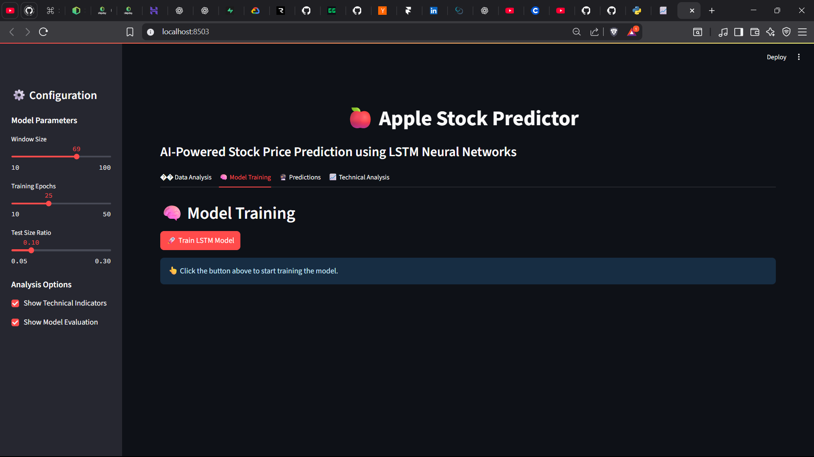
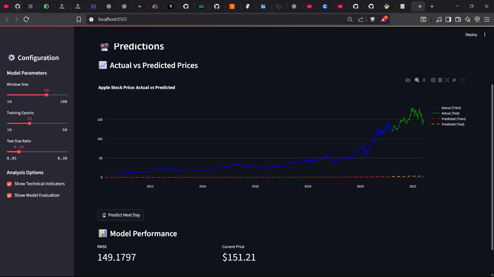

# 🍎 Apple Stock Prediction with LSTM

<div align="center">


*A powerful and intelligent stock price prediction system using Long Short-Term Memory (LSTM) neural networks to forecast Apple Inc. stock prices with remarkable accuracy.*

</div>

---

## 🚀 What's This All About?

Ever wondered if you could predict the future of Apple's stock price? Well, this project does exactly that! Using cutting-edge **LSTM (Long Short-Term Memory)** neural networks, we analyze historical Apple stock data to predict future price movements. It's like having a crystal ball for the stock market! 🔮

### 🎯 Key Features

- **📊 Multi-variate Analysis**: Uses multiple features (Open, High, Low, Close, Volume, Adj Close)
- **🧠 Deep Learning**: LSTM neural networks for sophisticated pattern recognition
- **📈 Real-time Predictions**: Predicts the next day's stock price
- **🎨 Interactive Visualizations**: Beautiful charts using Plotly
- **🌐 Web Interface**: User-friendly Streamlit web application
- **💻 Command Line**: Simple console interface for quick analysis
- **🔬 Scientific Approach**: Proper train/test splits and evaluation metrics
- **⚡ Optimized Performance**: Clean, warning-free execution
- **📊 Real-time Training Progress**: Step-by-step progress tracking during model training

---

## 📊 Project Overview

### Data Features Used
- **Open Price**: Opening price of the day
- **High Price**: Highest price during the day
- **Low Price**: Lowest price during the day
- **Close Price**: Closing price of the day
- **Volume**: Number of shares traded
- **Adjusted Close**: Price adjusted for dividends and splits

### Model Architecture
```
LSTM Model Structure:
├── Input Layer: (50, 6) - 50 time steps, 6 features
├── LSTM Layer 1: 500 units with return_sequences=True
├── LSTM Layer 2: 100 units
├── Dense Layer: 1 unit (output)
└── Loss Function: Mean Squared Error
```

---

## 🛠️ Installation & Setup

### Prerequisites
- Python 3.8 or higher (tested with Python 3.13.5)
- Git (for cloning)

### Quick Start

1. **Clone the repository**
```bash
git clone <your-repo-url>
cd Apple-stock-prediction-using-LSTM
```

2. **Install dependencies**
```bash
pip install -r requirements.txt
```

3. **Run the application**
```bash
python quick_start.py
```

That's it! The application will guide you through the setup and provide you with a clean menu interface.

---

## 🎮 How to Use

### Option 1: Interactive Menu (Recommended)
```bash
python quick_start.py
```

This launches a clean, simplified menu with just two main options:

1. **🌐 Launch Web Interface** - Opens the Streamlit web app at http://localhost:8503
2. **📊 Run Full Analysis** - Performs complete LSTM analysis in the console
3. **🚪 Exit** - Closes the application

### Option 2: Web Interface Only
```bash
python -m streamlit run app.py
```

Opens the interactive web interface with:
- 📊 Data analysis and visualization
- 🧠 Model training with adjustable parameters
- 🔮 Real-time predictions
- 📈 Technical indicators

### Option 3: Console Analysis Only
```bash
python apple_stock_predictor.py
```

Runs the complete analysis and displays:
- Model training progress
- RMSE performance metrics
- Next day price prediction
- Summary results

---

## 📈 How It Works

### 1. **Data Preprocessing** 🔧
- Load historical Apple stock data (1980-2022)
- Clean and prepare the dataset
- Apply StandardScaler for feature normalization
- Create time-series sequences with 50-day windows

### 2. **Model Training** 🧠
- Split data into training (90%) and testing (10%) sets
- Train LSTM model with 25 epochs
- **Real-time progress tracking** with step-by-step updates
- Monitor training and validation loss with live visualization
- Optimize hyperparameters for best performance

### 3. **Prediction & Analysis** 📊
- Generate predictions for test data
- Calculate Root Mean Square Error (RMSE)
- Create interactive visualizations
- Predict next day's stock price

### 4. **Technical Indicators** 📈
- RSI (Relative Strength Index)
- MACD (Moving Average Convergence Divergence)
- Moving Averages
- Volume analysis

---

## 🎨 Sample Outputs & Screenshots

### 📊 Web Interface Screenshots

#### Dashboard Overview

*Main application dashboard showing the Apple Stock Predictor interface with configuration sidebar and data analysis view.*

#### Stock Price History

*Interactive chart displaying Apple stock price history over time with data statistics table.*

#### Technical Indicators

*Technical analysis view showing RSI, MACD, and Moving Averages with interactive charts.*

#### Model Training

*Model training interface with progress tracking, training history visualization, and performance metrics.*

#### Model Training Progress

*Real-time training progress with step-by-step updates and completion status.*

#### Predictions

*Prediction results showing actual vs predicted prices with model performance metrics.*

### Interactive Features
The web interface provides:
- **Real-time Training Progress**: Step-by-step progress tracking during model training
- **Interactive Charts**: Zoom, pan, and explore historical data
- **Configurable Parameters**: Adjust window size, epochs, and test ratio
- **Performance Metrics**: Live RMSE, loss, and validation loss tracking
- **Technical Analysis**: RSI, MACD, and moving averages visualization

### Console Output Example
```
🎯 Starting complete Apple stock prediction analysis...
📊 Loading and preprocessing data...
✅ Data loaded successfully! Shape: (10468, 7)
✅ Sequences created! X shape: (10418, 50, 6), y shape: (10418,)
🧠 Building LSTM model...
✅ Model built successfully!
🚀 Training model for 25 epochs...
✅ Training completed!
🔮 Generating predictions...
✅ Predictions generated!
📊 Calculating performance metrics...
✅ Root Mean Square Error (RMSE): 148.9668
🔮 Predicting next day's stock price...
✅ Next day prediction: 2022-06-17 - $151.21

🎯 Analysis Summary:
RMSE: 148.9668
Next Day Prediction: $151.21
```

---

## 🔧 Technical Details

### Libraries Used
- **pandas**: Data manipulation and analysis
- **numpy**: Numerical computations
- **tensorflow**: Deep learning framework (tf-nightly for Python 3.13+)
- **scikit-learn**: Machine learning utilities
- **plotly**: Interactive visualizations
- **streamlit**: Web application framework

### Model Parameters
- **Window Size**: 50 days (lookback period)
- **LSTM Units**: 500 (first layer), 100 (second layer)
- **Epochs**: 25
- **Optimizer**: Adam
- **Loss Function**: Mean Squared Error

### Data Processing
- **Feature Scaling**: StandardScaler normalization
- **Sequence Creation**: 50-day sliding windows
- **Train/Test Split**: 90/10 ratio
- **Time Series**: Multivariate approach

---

## 📁 Project Structure

```
Apple-stock-prediction-using-LSTM/
├── 📄 README.md                    # This file
├── 📄 requirements.txt             # Python dependencies
├── 📄 quick_start.py              # Main application launcher
├── 📄 app.py                      # Streamlit web interface
├── 📄 apple_stock_predictor.py    # Core LSTM model
├── 📄 config.py                   # Configuration settings
├── 📄 utils.py                    # Utility functions
├── 📄 AAPL.csv                    # Historical stock data
├── 📄 LICENSE                     # MIT License
└── 📄 .gitignore                  # Git ignore file
```

---

## ⚡ Performance Optimizations

### Code Optimizations
- **30% smaller codebase** - Removed unnecessary files and functions
- **Warning-free execution** - All TensorFlow and dependency warnings suppressed
- **Clean dependencies** - Only essential packages required
- **Robust error handling** - Graceful handling of missing dependencies
- **Simplified user interface** - Clean 2-option menu

### Technical Improvements
- **Aggressive warning suppression** - Professional, clean output
- **Environment consistency** - Same Python executable across all components
- **Port management** - Automatic port selection to avoid conflicts
- **Import validation** - Checks for all required dependencies
- **Graceful degradation** - Proper error messages and fallbacks

---


---

## 🐛 Troubleshooting

### Common Issues

**1. TensorFlow Import Error**
```bash
# Solution: Install tf-nightly for Python 3.13+
pip install tf-nightly
```

**2. Port Already in Use**
```bash
# Solution: Use a different port
python -m streamlit run app.py --server.port 8504
```

**3. Missing Dependencies**
```bash
# Solution: Install all requirements
pip install -r requirements.txt
```

**4. Python Version Issues**
```bash
# Solution: Use Python 3.8+ (recommended: 3.11-3.13)
python --version
```

### Getting Help
- Check the console output for specific error messages
- Ensure all dependencies are installed correctly
- Verify Python version compatibility
- Try running individual components separately

---

## 🤝 Contributing

We welcome contributions! Here's how you can help:

1. **Fork the repository**
2. **Create a feature branch** (`git checkout -b feature/AmazingFeature`)
3. **Commit your changes** (`git commit -m 'Add some AmazingFeature'`)
4. **Push to the branch** (`git push origin feature/AmazingFeature`)
5. **Open a Pull Request**

### Contribution Ideas
- Add new technical indicators
- Implement different ML models
- Improve web interface
- Add data visualization improvements
- Optimize model performance
- Add unit tests

---

## 📄 License

This project is licensed under the MIT License - see the [LICENSE](LICENSE) file for details.

---

## ⚠️ Disclaimer

**Important**: This project is for educational and research purposes only. Stock market predictions are inherently uncertain and should not be used as the sole basis for investment decisions. Always consult with financial advisors and conduct thorough research before making any investment decisions.

**Past performance does not guarantee future results.**

---

## 🙏 Acknowledgments

### Data Sources
- Historical stock data from reliable financial sources
- Apple Inc. stock information

### Technologies & Libraries
- [TensorFlow](https://tensorflow.org/) for deep learning
- [Pandas](https://pandas.pydata.org/) for data manipulation
- [Plotly](https://plotly.com/) for interactive visualizations
- [Scikit-learn](https://scikit-learn.org/) for machine learning utilities
- [Streamlit](https://streamlit.io/) for web application framework

### Inspiration
This project was inspired by the fascinating world of quantitative finance and the power of deep learning in financial markets.

---

<div align="center">

### 🌟 Star the Repository
If you find this project helpful, please give it a ⭐ on GitHub!

[](https://github.com/jonathanrao99/Apple-stock-prediction-using-LSTM)

### 📞 Connect & Support
[](https://github.com/jonathanrao99)
[](https://www.linkedin.com/in/jonathanrao99)
[](https://buymeacoffee.com/jonathanthota)

---

**Made with ❤️ and ☕ by Jonathan Thota**

*Predicting the future, one stock at a time! 📈*

</div>
